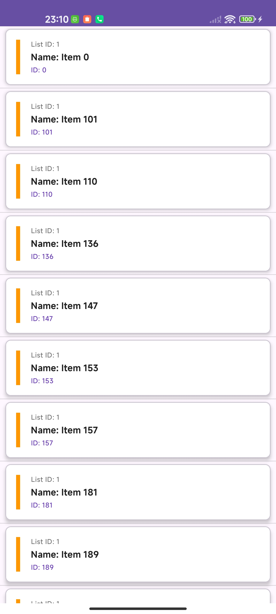

<p align="center">

<h1 align="center"> Fetch Rewards </h1>
<p align="center">
Android Engineer Apprentice Assignment
</p>
</p>

This app fetches data from a specific JSON endpoint, filters and sorts it according to predefined rules, caches it locally, and displays the results in a user-friendly list with swipe-to-refresh functionality.

[](https://www.linkedin.com/in/timothysliu/)

## Version Highlights

* **v0.0.1:** Implemented the core requirements: fetching data from the JSON endpoint, filtering out items with null/blank names, sorting items by `listId` then `name`, and displaying them in a basic list.
* **v0.0.2:** Enhanced the application with several key additions: implemented unit tests for data components, added a custom app logo and splash screen, integrated swipe-to-refresh functionality for manual data updates, and improved the overall layout aesthetics.


## Table of Contents

1.  [Screenshots](#-screenshots)
2.  [Features](#-features)
3.  [Built With](#-built-with)
4.  [Architecture](#️-architecture)
5.  [Package Structure](#-package-structure)

---

## 📸 Screenshots


<table>
  <tr>
     <th>Main List (Sorted & Grouped)</th>
     <th>Swipe-to-Refresh Action</th>
  </tr>
  <tr>
    <td>
      <p align="center"></p>
      <p align="center">
  
</p>
    </td>
    <td>
       <p align="center"></p>
        <p align="center">
      
</p>
    </td>
  </tr>
 </table>

---

## 🌟 Features

* **Fetch Data:** Retrieves item list from `hiring.json` endpoint.
* **Filter Items:** Excludes items with null or blank names.
* **Sort Items:** Sort items first by `listId`, then by `name`.
* **Visual Grouping:** Achieves grouping by `listId` through sorting in the list display.
* **Caching:** Stores processed data locally using Room DB.
* **Swipe-to-Refresh:** Allows manual data updates with a pull-down gesture. *(Added in v0.0.2)*
* **Splash Screen:** Displays splash screen during startup. *(Added in v0.0.2)*
* **App Logo:** Custom application icon. *(Added in v0.0.2)*
* **Unit Tested:** Includes JUnit/Mockito tests for core data components. *(Added in v0.0.2)*
* **Improved UI:** Enhanced layout presentation. *(Added in v0.0.2)*

---

## 🛠 Built With


* [Kotlin](https://kotlinlang.org/) - Official language for Android development.
* [Coroutines](https://kotlinlang.org/docs/reference/coroutines-overview.html) - For managing background threads and asynchronous operations.
* [Android Architecture Components](https://developer.android.com/topic/libraries/architecture) - Best practices for robust, testable, and maintainable apps.
    * [LiveData](https://developer.android.com/topic/libraries/architecture/livedata) - Observable data holder class, lifecycle-aware.
    * [ViewModel](https://developer.android.com/topic/libraries/architecture/viewmodel) - Stores UI-related data, surviving configuration changes.
    * [Data Binding](https://developer.android.com/topic/libraries/data-binding) - Binds UI components in layouts to data sources declaratively.
    * [Room](https://developer.android.com/topic/libraries/architecture/room) - SQLite object mapping library for local persistence.
    * [Fragment](https://developer.android.com/guide/fragments) - Reusable UI components.
    * [RecyclerView](https://developer.android.com/guide/topics/ui/layout/recyclerview) - Efficiently displays large sets of data.
    * [SwipeRefreshLayout](https://developer.android.com/develop/ui/views/touch-and-input/swipe-refresh) - Provides the pull-to-refresh UI pattern.
* [Retrofit](https://square.github.io/retrofit/) - Type-safe HTTP client for Android.
* [Moshi](https://github.com/square/moshi) - Modern JSON library for Android, Kotlin, and Java.
* [okhttp-logging-interceptor](https://github.com/square/okhttp/blob/master/okhttp-logging-interceptor/README.md) - Logs HTTP request and response data.
* [Material Components for Android](https://github.com/material-components/material-components-android) - UI components following Material Design guidelines.
* [JUnit 4](https://junit.org/junit4/) & [Mockito](https://site.mockito.org/) / [Mockito-Kotlin](https://github.com/mockito/mockito-kotlin) - For unit testing.
* [Gradle Kotlin DSL](https://docs.gradle.org/current/userguide/kotlin_dsl.html) - For writing Gradle build scripts using Kotlin.

---

## 🏛️ Architecture

This app is based on the [***MVVM (Model-View-ViewModel)***](https://developer.android.com/jetpack/guide#recommended-app-arch) architecture pattern combined with a Repository pattern for data handling.


---

## 📦 Package Structure

```
com.example.fetch_timothyliu_android/     # Root Package
├── data/                                 # Data handling layer
│   ├── local/                            # Room DB, DAO, LocalDataSource
│   ├── model/                            # Data classes (NetworkItem, Item)
│   ├── remote/                           # Retrofit Service, RemoteDataSource
│   └── repository/                       # ItemRepository implementation
│
├── ui/                                   # UI Layer (View + ViewModel)
│   └── adapter/                          
│   ├── fragment/    
│   ├── viewmodel/           
```
---
## 📧 Contact

Thanks for your time reviewing this assignment! You can reach me via:

[](https://www.linkedin.com/in/timothysliu/) [](mailto:timo9036@hotmail.com)
